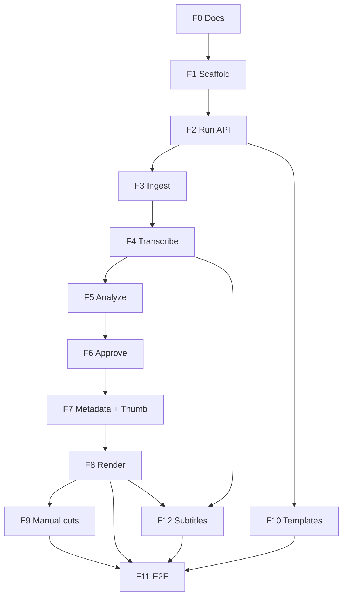

# MVP — Fases de implementação

Plano incremental para entregar **as 5 primeiras pipelines** com commit git a cada fase concluída.

---

## Escopo do MVP

| Incluído | Excluído (pós-MVP) |
|----------|-------------------|
| Pipeline 1 — URL → Shorts | Pipeline 6 — arquivo local |
| Pipeline 2 — URL → Cortes longos | Pipeline 7 — só metadados |
| Pipeline 3 — URL → Shorts + Longos | Pipeline 8 — outro append |
| Pipeline 4 — URL → Só análise | Frontend completo (fase 8) |
| Pipeline 5 — URL + timestamps manuais | Multi-tenant / auth avançado |
| Templates de thumbnail (CRUD) | |
| Go API + Redis + 1 worker Python | |

---

## Visão geral das fases

```text
F0  Documentação
F1  Scaffold backend (Go + Docker + migrations)
F2  Domínio run + POST /v1/runs + Redis enqueue
F3  Worker ingest (yt-dlp)
F4  Worker transcribe
F5  Worker analyze (Gemini + cutBrief)
F6  Approve flow + Pipeline 4 (analyze_only)
F7  Worker metadata + thumbnail
F8  Worker render (short + long)
F9  Pipeline 5 (render_from_cuts)
F10 Templates CRUD + seed
F11 Integração E2E + CLI de teste
```

Cada fase = **1 commit** (ou PR) quando estiver funcional ou doc-only completa.

---

## F0 — Documentação ✅

**Entrega:** `docs/` completo + README atualizado.

**Commit:** `docs: add architecture, pipelines, MVP phases and contracts`

**Arquivos:**
- `docs/ARCHITECTURE.md`
- `docs/PIPELINES.md`
- `docs/INPUT-OUTPUT.md`
- `docs/TEMPLATES.md`
- `docs/CUT-BRIEF.md`
- `docs/MVP-PHASES.md`
- `README.md`

---

## F1 — Scaffold backend

**Objetivo:** repo Go compilável, Postgres + Redis via docker-compose, health check.

**Entrega:**
```text
backend/
├── docker-compose.yml
├── migrations/001_init.sql
├── server/cmd/server/main.go
├── server/internal/httpserver/
└── Makefile
```

**Endpoints:**
- `GET /health`
- `GET /ready` (Postgres + Redis)

**Commit:** `feat(backend): scaffold Go server with docker-compose`

---

## F2 — Domínio run + criar pipeline

**Objetivo:** `POST /v1/runs` persiste run e enfileira primeiro job.

**Entrega:**
- Tabelas: `runs`, `cuts`, `jobs_log`
- Módulos: `run/handler`, `run/service`, `run/repository`
- Validação de `pipeline`, `youtubeUrl`, `thumbnailTemplateId`
- Enqueue `ingest.youtube.download` no Redis

**Endpoints:**
- `POST /v1/runs`
- `GET /v1/runs/{id}`
- `GET /v1/runs/{id}/status`

**Commit:** `feat(api): add run domain and POST /v1/runs`

---

## F3 — Worker ingest

**Objetivo:** baixar vídeo de URL YouTube.

**Entrega:**
- `backend/worker/` (monolítico inicial)
- Handler `ingest.youtube.download`
- yt-dlp → `/data/runs/{runId}/source/video.mp4`
- Atualiza run status → enfileira `transcribe.run`

**Commit:** `feat(worker): add YouTube ingest with yt-dlp`

---

## F4 — Worker transcribe

**Objetivo:** gerar `transcript.json`.

**Entrega:**
- Legendas YouTube (preferência) ou Whisper fallback
- Enfileira `analyze.gemini` (ou para se `pipeline: analyze_only` após analyze)

**Commit:** `feat(worker): add transcription pipeline`

---

## F5 — Worker analyze (Gemini)

**Objetivo:** `cutBrief` → `cuts.json`.

**Entrega:**
- Integração Gemini API
- Presets de [CUT-BRIEF.md](./CUT-BRIEF.md)
- Suporta `shorts_only`, `long_only`, `full`
- Status `awaiting_approval` se `requireApproval: true`

**Commit:** `feat(worker): add Gemini analyze with cutBrief`

---

## F6 — Approve + Pipeline 4

**Objetivo:** pausar após análise; pipeline `analyze_only` termina sem render.

**Entrega:**
- `POST /v1/runs/{id}/approve` — body com cuts aprovados/rejeitados
- `GET /v1/runs/{id}/cuts` — retorna `cuts.json`
- Pipeline `analyze_only` → status `completed` após analyze (sem render jobs)

**Commit:** `feat(api): add cut approval and analyze_only pipeline`

---

## F7 — Metadata + thumbnail

**Objetivo:** título, descrição, tags e PNG por cut.

**Entrega:**
- Job `metadata.generate` (Gemini)
- Job `thumbnail.generate` (template + título)
- Arquivos em `shorts/{cutId}/` e `long/{cutId}/`

**Commit:** `feat(worker): add metadata and thumbnail generation`

---

## F8 — Worker render

**Objetivo:** pipelines 1, 2, 3 produzem vídeos finais.

**Entrega:**
- `render.short` — 9:16, yuv420p, legenda opcional (burnSubtitles)
- `render.long` — 16:9 extract
- `manifest.json` ao concluir run

**Commit:** `feat(worker): add FFmpeg render for shorts and long cuts`

---

## F9 — Pipeline 5 (timestamps manuais)

**Objetivo:** pular Gemini; render direto de `cuts` fornecido.

**Entrega:**
- `pipeline: "render_from_cuts"` com `cuts` no body
- Validação de schema cuts.json
- Fluxo: ingest → skip analyze → metadata → thumbnail → render

**Commit:** `feat(api): add render_from_cuts pipeline with manual timestamps`

---

## F10 — Templates CRUD

**Objetivo:** biblioteca de estilos de thumbnail.

**Entrega:**
- Tabela `templates`
- `GET/POST/PATCH/DELETE /v1/templates`
- Upload multipart (pattern.png, character.png, config.json)
- Seed: `generic-dark`, `leetcode-dsa-quest`

**Commit:** `feat(api): add thumbnail template CRUD`

---

## F11 — Integração E2E

**Objetivo:** provar as 5 pipelines de ponta a ponta.

**Entrega:**
- `backend/scripts/e2e.sh` ou `cmd/cli`
- README com exemplos curl para cada pipeline
- Checklist de smoke test

**Commit:** `test: add E2E scripts for all MVP pipelines`

---

## Matriz pipeline × fase

| Pipeline | Fases necessárias |
|----------|-----------------|
| 1 Shorts | F1–F8 |
| 2 Long | F1–F8 |
| 3 Full | F1–F8 |
| 4 Analyze only | F1–F6 |
| 5 Manual cuts | F1–F4, F7–F9 (skip F5) |

---

## Convenção de commits

```text
docs:     documentação
feat:     feature nova
fix:      correção
test:     testes / e2e
chore:    deps, docker, CI
```

Formato: `<tipo>(escopo): descrição curta`

Exemplos:
- `docs: add MVP phase plan and architecture`
- `feat(api): POST /v1/runs with pipeline validation`
- `feat(worker): yt-dlp ingest job`

---

## Ordem de dependências



---

## F12 — Subtitle templates + burn-in (planejado)

**Objetivo:** legendas aprovadas no prototipo `legendas-mvp` em producao.

**Seeds prontos:**
- `backend/seeds/subtitle-templates/default.json`
- `backend/seeds/subtitle-templates/mission.json`
- `backend/migrations/004_subtitle_templates.sql`
- `backend/worker/cuts_worker/subtitle_engine.py`

**Entrega pendente:**
- Whisper word timestamps em `transcribe.run`
- `GET /v1/subtitle-templates` (+ CRUD opcional)
- `subtitleTemplateId` no `POST /v1/runs`
- Worker `subtitle.generate` → `subtitles.ass`
- `render.short` com burn quando `burnSubtitles: true`

**Commit:** `feat(subtitles): add template seeds and ASS engine`

---

## F12 — Edição de cortes na revisão

**Entrega:**
- `PATCH /v1/runs/{id}/cuts/{cutId}`
- `POST /v1/runs/{id}/cuts`
- `DELETE /v1/runs/{id}/cuts/{cutId}`
- UI editável no `CutReviewPanel`

**Commit:** `feat(api): cut edit CRUD during approval review`

---

## F13 — Job logs + operações de run

**Entrega:**
- `GET /v1/runs/{id}/jobs`
- `POST /v1/runs/{id}/cancel`
- `POST /v1/runs/{id}/reanalyze`
- `POST /v1/runs/{id}/retry`
- Status `cancelled` (migration 006)
- Worker ignora jobs de runs cancelados

**Commit:** `feat(api): run jobs list, cancel, reanalyze, and retry`

---

## F14 — PATCH templates + assets

**Entrega:**
- `PATCH /v1/templates/{id}`
- `PATCH /v1/subtitle-templates/{id}`
- `POST /v1/templates/{id}/assets`
- `GET /v1/templates/{id}/assets/{filename}`

**Commit:** `feat(api): PATCH templates and thumbnail asset upload`

---

## F15 — Polimento UX frontend

**Entrega:**
- Botões Cancel / Re-analyze / Retry no run detail
- Painel Jobs colapsável
- Filtro `cancelled`, pre-fill URL em novo run
- Indicador `hasAssets` na lista de templates

**Commit:** `feat(ui): run ops, editable cuts, and template management`

---

## F16 — Observabilidade do worker

**Entrega:** worker persiste `runs.error_message` e atualiza `jobs_log` em sucesso/falha.

Ver [FUTURE-PHASES.md](./FUTURE-PHASES.md) para F17+ (pipelines 6–8, re_render_cut, batch, etc.).

---

## Próximo passo

Roadmap completo em [FUTURE-PHASES.md](./FUTURE-PHASES.md). Prioridade imediata: **F16** (observabilidade), depois E2E dos pipelines 1–5, depois pipeline 6 (vídeo local Woragis).
