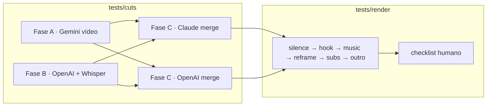

# Testes — Máquina de Cortes

Laboratório local para validar **detecção de cortes (ABC)** e **render profissional** antes de promover mudanças ao worker de produção.

## Estrutura

| Pasta | Propósito |
|-------|-----------|
| [`cuts/`](cuts/README.md) | Pipeline A→B→C com 4 vereditos (Gemini, OpenAI/Whisper, merge Claude, merge OpenAI) |
| [`render/`](render/README.md) | Render incremental por corte (silêncio, hook, música, legenda, outro, thumbnail) |
| [`fixtures/`](fixtures/default-run.json) | VOD de referência, paths e defaults |
| [`DECISIONS.md`](DECISIONS.md) | Decisões fechadas antes dos testes |

## Fluxo recomendado



1. Rodar `cuts/run_abc_pipeline.py` → gera `cuts/output/{run_id}/validation.md` com 4 seções.
2. Escolher veredito (Claude ou OpenAI) para render.
3. Rodar `render/run_treatment_cut.py` por corte e formato (short/long).
4. Preencher [`render/CHECKLIST-RENDER.md`](render/CHECKLIST-RENDER.md) com notas.

## VOD de referência

Default: [Arthur do Val · live eKxFuD3-pos](https://www.youtube.com/watch?v=eKxFuD3-pos) (~1h49).

Resultados históricos copiados de `backend/worker/scripts/results/` estão em `fixtures/results/20260624T225609Z_eKxFuD3-pos/` (baseline A/B/C antigo).

## Princípios v2 (desde Jun/2026)

- **Corte completo > hook no início** — o viewer precisa entender o assunto inteiro.
- **Shorts ~70s ideal, até ~130s** — resumo com contexto; até ~2 min se a explicação exige.
- **Longs ~8 min ideal, até ~15 min** — podem ficar curtos se focados; estender quando explicar tudo.
- **Fase C + transcriptBefore** — estende startSec quando A/B começam no meio da discussão.
- **Marcar `uselessParts`** já nas fases A e B; a fase C preserva ou propõe trim.
- **Compare C-Claude vs C-OpenAI** — mesmos inputs, dois vereditos finais.
- **Render separado** — áudio (LUFS/dB), transições, hooks/re-hooks, outro long-only.

## Requisitos

```bash
cd backend/worker
pip install -r requirements.txt

export GEMINI_API_KEY=...
export OPENAI_API_KEY=...      # Whisper + fase B + merge OpenAI
export ANTHROPIC_API_KEY=...   # merge Claude
export ffmpeg yt-dlp           # no PATH
```

## Origem dos scripts

Copiados/adaptados de `backend/worker/scripts/`:

| Origem | Destino |
|--------|---------|
| `test_dual_merge_claude.py` | `cuts/run_abc_pipeline.py` |
| `treatment/run_first_test.py` | `render/run_treatment_cut.py` |
| `treatment/run_short_finish_test.py` | `render/run_short_finish.py` |

Ver [`shared/SCRIPTS-LINEAGE.md`](shared/SCRIPTS-LINEAGE.md).
