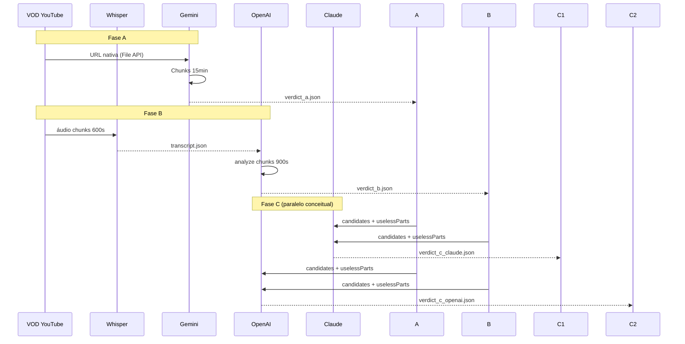

# Workflow ABC v2 — Diagrama e decisões

## Sequência



## O que cada fase vê

| Fase | Vídeo | Transcript | Veredito anterior |
|------|-------|------------|-------------------|
| A | ✅ URL | ❌ | — |
| B | ❌ | ✅ Whisper | — |
| C | ❌ | ✅ **transcriptBefore + inCluster + after** por cluster | A + B completos |

## Regras editoriais (todas as fases)

### ✅ Priorizar

- Tópico fechado: viewer entende **o quê**, **por quê** e **conclusão**
- Timestamps no timeline **global** do VOD
- Long cut quando 3+ shorts cobrem o mesmo assunto contíguo

### ❌ Evitar

- Começar no punchline sem contexto (a menos que re-hook trate isso no render)
- Cortes só porque "parece viral" sem substância
- Descartar candidato sem `rejectReason` na fase C

### `uselessParts`

Trechos **dentro** do intervalo `[startSec, endSec]` do corte:

```json
{
  "startSec": 4120,
  "endSec": 4145,
  "reason": "repetição do mesmo argumento",
  "severity": "trim"
}
```

| severity | Significado |
|----------|-------------|
| `trim` | Remover no render (silence step ou jump cut) |
| `optional` | Pode manter se encurtar prejudicar completude |
| `keep_for_context` | Mantém — transição necessária |

Fase C **herda** uselessParts de A/B, **mescla** overlaps, e pode **adicionar** novos após ler transcript.

## Duração — shorts

| | Segundos |
|---|----------|
| Ideal | **~70s** — resumido com contexto |
| Máximo | **~130s** — explicação densa |

## Duração — long cuts

| | Segundos |
|---|----------|
| Ideal | **~480s (~8 min)** — tópico focado |
| Máximo | **~900s (~15 min)** — explicação completa |

Mesma lógica dos shorts: **liberdade dentro do máximo** quando o assunto exige; **pode ficar curto** se couber com completude.

A fase C usa `transcriptBefore` (até **240s** antes, **360s** em clusters long) para `extend`.
Config em `fixtures/default-run.json` → `merge` / `targets`.

## Comparação C-Claude vs C-OpenAI

Mesmos inputs → dois JSON. Avaliar em `validation.md`:

| Critério | Pergunta |
|----------|----------|
| Completude | O tópico ficou inteiro? Começa com setup, não no meio? |
| Extend | `extendedBecause` faz sentido? |
| Deduplicação | Overlaps A∩B bem resolvidos? |
| uselessParts | Marcou enrolação real? |
| Long cuts | Agrupou shorts do mesmo tema? |
| Contagem | ~12 shorts + ~4 longs (config fixture) |

## Integração futura (produção)

Quando validado nos testes, propagar para:

- `cuts_worker/analyze.py` — prompts fase A
- `cuts_worker/dual_merge.py` — fase B OpenAI + schema uselessParts
- Novo `merge_cuts_with_openai()` espelhando Claude
