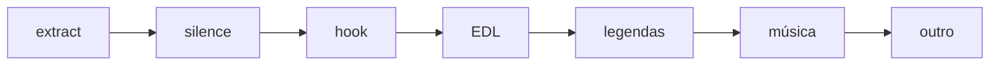

# Pipeline long 16:9 — v2 (spec)

Tratamento de **long cuts** antes de shorts/vertical. Implementação futura no worker; testes em `tests/render/`.

## Ordem dos passos



| # | Passo | Input | Output | IA? |
|---|-------|-------|--------|-----|
| 0 | **extract** | VOD + veredito `startSec/endSec` | `clip_raw.mp4` | não |
| 1 | **silence** | clip_raw + `uselessParts` trim | `clip_silence.mp4` | não |
| 2 | **hook** | clip_silence + `hookPlan` | `clip_hooked.mp4` | picker |
| 3 | **EDL** | clip_hooked + transcript | `clip_edl.mp4` | sim (barata) |
| 4 | **legendas** | clip_edl | `clip_subs.mp4` | Whisper + template |
| 5 | **música** | clip_subs | `clip_music.mp4` | não (LUFS/dB) |
| 6 | **outro** | clip_music | `clip_final.mp4` | não (fade A/V) |

**Fora do escopo v2 long:** reframing 9:16, assets, SFX, thumbnail (opcional depois).

---

## 1. Silence + uselessParts

Combina:

1. `silencedetect` (threshold do canal)
2. Intervalos do veredito com `uselessParts[].severity === "trim"`

Convertidos para timeline **local do clip** (0 = início do extract).

```json
{
  "silence": {
    "removals": [
      { "startSec": 12.4, "endSec": 13.1, "source": "silencedetect" },
      { "startSec": 45.0, "endSec": 52.0, "source": "uselessParts", "reason": "repetição" }
    ]
  }
}
```

`optional` e `keep_for_context` **não** entram em removals automáticos.

---

## 2. Hook / re-hook (long)

### Política

- **Sempre re-hook** no long, estilo **`imperceptible`**
- Teaser **2–4 s** do peak; depois contexto desde o início linear
- **Sem** B&W, sem swell de música, sem card (short pode ser mais marcado no futuro)

### hookCandidates (veredito fase C — schema futuro)

No corte ou no envelope:

```json
"hookCandidates": [
  {
    "startSec": 4120,
    "endSec": 4128,
    "score": 0.91,
    "reason": "número MEI ao vivo",
    "clipRelativeSec": 180
  }
]
```

- Timestamps VOD + `clipRelativeSec` após extract
- 2–5 candidatos por corte long

### hookPlan (treatment brief — após picker)

```json
{
  "hookType": "rehook",
  "hookStyle": "imperceptible",
  "peakSec": 180,
  "teaserEndSec": 184,
  "pickedFrom": "hookCandidates[0]",
  "pickerReason": "prefigura o setup do MEI",
  "segments": [
    { "startSec": 180, "endSec": 184, "role": "peak_teaser" },
    { "startSec": 0, "endSec": null, "role": "body" }
  ],
  "effects": {
    "visual": "none",
    "audio": "none"
  }
}
```

Long imperceptível = segmentos concatenados **sem** filtro extra; só ordem narrativa.

### Hook picker (IA OpenAI barata)

Input: `hookCandidates` + título/topic/reason do corte + primeiros 30s transcript  
Output: um candidato + `hookPlan`  
Modelo sugerido: `gpt-4o-mini`

---

## 3. EDL horizontal

Roda **depois** de silence + hook (timeline final de narrativa).

### Input IA

| Dado | Origem |
|------|--------|
| Probe vídeo | 640px, ~1 fps, `clip_hooked.mp4` |
| Transcript | Whisper, sync clip final |
| Veredito | topic, uselessParts já aplicados |
| Formato | `long`, 16:9 — **sem crop vertical** |

### editPlan.json (v1 mínimo)

```json
{
  "schemaVersion": 1,
  "format": "long",
  "aspect": "16:9",
  "segments": [
    {
      "startSec": 0,
      "endSec": 120,
      "visual": { "type": "hold", "zoom": 1.0 }
    },
    {
      "startSec": 120,
      "endSec": 145,
      "visual": { "type": "focus_content", "zoom": 1.12, "reason": "matéria na tela" }
    }
  ],
  "limits": {
    "maxDynamicEventsPerMin": 0.5,
    "maxZoom": 1.15
  }
}
```

### Tipos v1

| type | Uso |
|------|-----|
| `hold` | plano fixo (default) |
| `hard_cut` | join seco (raro) |
| `focus_content` | zoom leve em slide/headline |
| `slow_zoom_in` | explicação densa (cap duração) |

Executor: FFmpeg (`crop` / `zoompan` / copy) — implementação worker.

---

## 4. Legendas → música → outro

- **Legendas:** após EDL; burn-in ASS; fonte canal (Montserrat Bold)
- **Música:** ducking LUFS; config `politica-mbl.json`
- **Outro:** só long; fade vídeo + crossfade música outro (~0,5–1 s)

---

## Como testar (estado atual)

O wrapper `run_treatment_cut.py` ainda segue passos **legados** (inclui reframing). Para validar long v2:

1. Rodar ABC → escolher veredito C (qualquer long)
2. Manualmente por etapa: `RENDER_MODE=silence`, depois `hook`, etc.
3. Quando worker tiver EDL + uselessParts no silence, usar `PIPELINE-LONG-v2` end-to-end

Ver [`CHECKLIST-RENDER.md`](CHECKLIST-RENDER.md) por corte.

---

## Referências

- [`SCHEMA-treatment.md`](SCHEMA-treatment.md) — hookPlan, editPlan
- [`../cuts/SCHEMA-verdict.md`](../cuts/SCHEMA-verdict.md) — uselessParts, hookCandidates
- [`../DECISIONS.md`](../DECISIONS.md) — decisões fechadas
